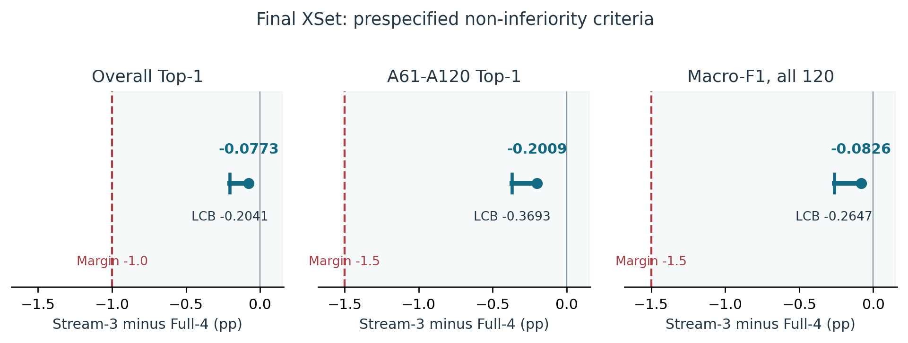

# AURA-KSP
### Auditable stream reduction for skeleton action recognition

**A quarter less measured latency. A 0.077 percentage-point overall accuracy loss. An explicitly bounded claim.**

AURA-KSP investigates how much computation can be removed from multi-stream skeleton action recognition while retaining prespecified aggregate quality. This release brings together the final NTU RGB+D 120 XSet results, frozen protocols, original model code, four checkpoints, aligned logits, raw latency traces, and CPU reproduction scripts.

> **Research artifact 1.0.0.** Code, metadata and selected numerical evidence are prepared for public release. License: **CC BY-NC 4.0**. Raw NTU data are excluded. The version DOI is recorded after assignment by Zenodo.

## The comparison

Both systems use the same retained checkpoints and 64 temporal positions. Full-4 combines joint, bone, joint-motion and bone-motion logits with weights `[0.3, 0.3, 0.2, 0.2]`. Stream-3 removes bone-motion and renormalizes the remaining weights to `[0.375, 0.375, 0.25]`. Fusion is the frozen float32 weighted-logit operation, not probability averaging or test-time weight fitting.

## Final quality results

Training: 54,468 retained official-training examples; final epoch 65. Evaluation: 59,477 XSet test examples. All differences are Stream-3 minus Full-4.

| Endpoint | Full-4 (%) | Stream-3 (%) | Difference (pp) | Lower bound (pp) | Margin (pp) |
|---|---:|---:|---:|---:|---:|
| Overall Top-1 | 89.105032 | 89.027691 | −0.077341 | −0.204138 | −1.0 |
| A61–A120 Top-1 | 87.067234 | 86.866383 | −0.200851 | −0.369294 | −1.5 |
| Macro-F1, all 120 | 89.105911 | 89.023340 | −0.082571 | −0.264688 | −1.5 |

All three prespecified non-inferiority gates passed. Bounds use 10,000 frozen paired setup bootstrap draws, centered-basic intervals, and Bonferroni alpha 0.05/3. A separately implemented numerical check reproduced the complete stored bootstrap array exactly in its recorded environment.



Full-4 correctly classifies **52,997** samples and Stream-3 **52,951**: a net difference of **46**. Recall decreases for 61 classes, is unchanged for 22, and increases for 37. The worst class recall difference is A073, −2.459 pp. Aggregate non-inferiority is not a guarantee for each class.

A small net difference also conceals individual changes: 605 correct decisions became errors and 559 errors were corrected. Predicted labels changed for 1,778 examples (2.9894%); 614 of those changes were between two incorrect labels. See the complete [descriptive error analysis](analysis/decision_changes/README.md).

## Latency is a separate measurement

| RTX 4090, batch 1 | Full-4 (ms) | Stream-3 (ms) | Latency reduction |
|---|---:|---:|---:|
| Warm reuse | 65.2755 | 48.9959 | 24.9399% |
| Fresh mapping | 68.5097 | 51.8634 | 24.2977% |

These traces used seed-271828 models from the earlier campaign. Final checkpoints were **not** timed again. A latency reduction is not the same numerical quantity as a throughput increase. See raw paired traces under `evidence/latency`.

## Reproduce without a GPU

Requires Python 3.11 or 3.12. Extract `repository` and `research-assets` as sibling directories. From `repository`:

```bash
python -m pip install -r requirements-audit.txt
python scripts/verify_release.py
python scripts/reproduce_final.py --assets ../research-assets --output .reproduced/final
python scripts/reproduce_latency.py --trace-root evidence/latency/raw --protocol-file evidence/latency/PROTOCOL.json --output .reproduced/latency
python scripts/describe_paired_errors.py --assets ../research-assets --output .reproduced/decision_changes
```

On Windows PowerShell, replace `python` with `py -3.11`. These commands read saved predictions and traces; they do not train models or run inference. See [reproduction details](docs/REPRODUCIBILITY.md).

## What is included

| Location | Purpose |
|---|---|
| `scripts/` | Hash verification, independent quality recomputation, latency analysis, figure construction |
| `tables/`, `figures/` | Exact numerical tables and publication figures |
| `manuscript/` | MDPI author manuscript, supplement and complete LaTeX sources |
| `evidence/` | Frozen protocol, plan, bindings, earlier quality audit, raw latency evidence |
| `runtime/` | Historical scientific training/data/model code with original pins |
| `reports/` | Prior independent audit and this release's validation |
| `../research-assets/` | Four final models, four prediction files, frozen draws, sample metadata, receipts, derived comparison |
| `docs/` | Methods, limitations, provenance, publication instructions |
| `analysis/decision_changes/` | Post-hoc decomposition of fixed predictions, all 120 classes and complete label-pair matrices |
| `tools/publishing/` | Checked local packaging helper and Windows PowerShell publication workflow |

## What the evidence supports

For this frozen system pair on NTU120 XSet, removing bone-motion met the prespecified aggregate quality margins. Earlier hardware measurements met the latency gate. This is a controlled efficiency result; it is not a new recognition architecture or a SOTA claim.

The unsuccessful temporal K32 branch is retained in the results and research history. Development choices preceded the final test; they should not be represented as a single hypothesis fixed before all exploration. A61–A120 is the strongest held-out action subset within NTU120, not an external dataset. A1–A60 is connected to earlier NTU60 work. No seed-wide or device-wide generalization is established.

## Authors and funding

Aida Issembayeva · **Oleksandr Kuznetsov** · Anargul Shaushenova · Ardak Nurpeisova · Lyazzat Zhumaliyeva · Maral Ongarbayeva.

ORCID identifiers and affiliations are recorded in [CITATION.cff](CITATION.cff). This research has been funded by the Science Committee of the Ministry of Science and Higher Education of the Republic of Kazakhstan (Grant No. AP23486538 Research and development of a system for recognizing images in video streams based on artificial intelligence).

## Citation and reuse

Use the version-specific Zenodo DOI once it is assigned. `CITATION.cff` contains the complete author list; no fictitious DOI is supplied. The companion manuscript is **Stream Reduction in Multi-Stream Graph Convolutional Networks: A Non-Inferiority Study for Skeleton-Based Action Recognition**. It is an author manuscript, not a claim of journal acceptance or publication.

The research code, assets and identified CTR-GCN adaptations are provided under **CC BY-NC 4.0**: attribution is required and commercial permission is not granted. See [LICENSE](LICENSE), [scope](LICENSE_SCOPE.md), and [third-party notices](THIRD_PARTY_NOTICES.md). Benchmark access remains subject to NTU's own terms; the project does not license the original dataset. The manuscript and original article figures are separately licensed under CC BY 4.0. Software dependencies keep their own licenses.

[Research history](docs/RESEARCH_HISTORY.md) · [Reproducibility](docs/REPRODUCIBILITY.md) · [Publishing](tools/publishing/START_HERE_RU.md) · [Contributing](CONTRIBUTING.md)
